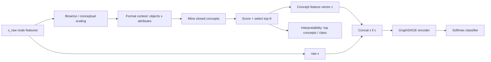

# Classification using GraphSAGE and FCA (АФП)

Reproducible research code for node classification where **Formal Concept
Analysis (FCA / АФП)** is used as an *interpretable feature-engineering layer*
in front of **GraphSAGE**.

> **Main hypothesis.** FCA-derived concept features can improve the quality,
> robustness, or interpretability of GraphSAGE relative to a raw-feature
> baseline and to controls of equal added dimensionality (SVD).

This repository is built for a short master's course project: the priority is a
**simple, clean, reproducible** pipeline that produces the tables and figures a
thesis needs — not a new GNN architecture.

---

## 1. Research questions

- **RQ1 (main).** *Under what conditions* do FCA concept features improve
  GraphSAGE, and is any gain specific to FCA structure or explained by added
  dimensionality? (compare vs vanilla GraphSAGE **and** a K-matched SVD control).
- **RQ2.** How does the effect depend on concept count K, membership type
  (hard/soft), and concept-selection criterion (support / lift / target-entropy)?
- **RQ3.** Does FCA help **low-degree** nodes more, where neighbourhood
  aggregation carries less signal? (degree-bucket analysis)

The v2 framing is a *controlled study* of GraphSAGE + FCA, not a universal
improvement claim: results are dataset-dependent and negative cases (e.g. PubMed
under binary scaling) are reported, not hidden.

**Success** = a consistent, statistically reasonable improvement (mean ± std over
seeds) on at least one core dataset, *especially* macro-F1 or low-label gains.
**A negative-but-useful result** (FCA ≈ raw, or FCA ≈ SVD control) is still a
valid, defensible outcome and is reported honestly.

## 2. Pipeline



No label leakage: concept *mining* is fully unsupervised; supervised *scorers*
(`target_entropy`, `lift`) and all class-association statistics use **training
labels only**.

## 3. Installation

Python 3.10+. Install PyTorch first (CPU example), then the rest:

```bash
pip install torch==2.2.2 --index-url https://download.pytorch.org/whl/cpu
pip install torch_geometric
pip install -r requirements.txt          # numpy/pandas/scipy/sklearn/matplotlib/yaml
# optional extras:
pip install ogb                            # for ogbn-arxiv
```

The FCA miner is **self-contained** (pure NumPy) — `caspailleur`/`paspailleur`
are optional and only used if `features.fca.backend: caspailleur`.

## 4. Quickstart

```bash
# 1) download + summarize the core datasets
python scripts/prepare_data.py

# 2) run a single experiment across its seeds (fully driven by YAML)
python -m src.train.run --config configs/experiments/cora_sage_raw.yaml
python -m src.train.run --config configs/experiments/cora_sage_fca.yaml

# 3) run the whole core battery + aggregate + report + figures
python scripts/run_core.py

# 4) (re)build tables and figures from results/
python -m src.eval.aggregate
python -m src.eval.report
python scripts/make_figures.py
```

Override anything from the CLI without editing files:

```bash
python -m src.train.run --config configs/experiments/cora_sage_fca.yaml \
       --set model.hidden_channels=64 features.fca.k_concepts=256 --seeds 0 1 2
```

Grid sweeps (same tuning budget for baseline and FCA):

```bash
python -m src.train.grid --config configs/experiments/cora_sage_fca.yaml \
       --grid configs/grids/k_concepts.yaml         # K ablation -> figure
python -m src.train.grid --config configs/experiments/cora_sage_fca.yaml \
       --grid configs/grids/default.yaml --max-runs 8
```

## 4b. Controlled mechanistic study (v2)

The deeper study turns "add FCA features" into *when and why* FCA helps. One
command runs the whole thing (fresh, 5 seeds) and regenerates every table/figure:

```bash
python scripts/run_v2.py --fresh                 # full study (~1.5 h CPU)
python scripts/run_v2.py --quick                 # fast smoke (1 seed, cora+citeseer)
```

It is built from disjoint, individually runnable ablations:

```bash
# K-sweep + K-matched SVD controls (FCA-K is compared to SVD-K, not SVD-128)
python scripts/run_ablation_k.py        --datasets cora citeseer pubmed --ks 32 64 128 256
# hard vs soft intent-overlap membership
python scripts/run_ablation_membership.py --datasets cora citeseer pubmed --k 128
# concept-selection criterion: support vs lift vs target_entropy (train-only)
python scripts/run_ablation_scorers.py  --datasets cora citeseer --k 128
# structural analysis + interpretability artifacts
python scripts/analyze_degree_buckets.py     # low/med/high-degree behavior
python scripts/analyze_concepts.py           # intent-size stats, cleaned top concepts
```

Each ablation fixes everything in YAML and varies only its one axis; the SVD
control is matched by **added dimensionality** so any FCA gain over it is
specific to concept structure, not just extra dimensions.

## 5. Repository layout

```
.
├── README.md  requirements.txt
├── configs/
│   ├── base.yaml                  # all defaults; experiments inherit via `extends`
│   ├── datasets/                  # per-dataset partials (cora, citeseer, pubmed, ...)
│   ├── experiments/               # one self-contained YAML per experiment
│   └── grids/                     # k_concepts / scorer / default HP sweeps
├── src/
│   ├── data/        # loaders -> unified GraphData; dataset summaries
│   ├── fca/         # binarize -> mine -> score/select -> features -> integrate
│   ├── models/      # MLP/LogReg, GraphSAGE, GCN + factory
│   ├── train/       # run.py (CLI), loop.py (1 run), grid.py (sweep)
│   ├── eval/        # metrics, aggregate (mean/std/deltas), report
│   └── utils/       # config (extends+overrides), io, seed, paths, logging
├── scripts/         # prepare_data, build_fca_cache, run_core, make_figures,
│                     # run_v2, run_ablation_{k,membership,scorers}, analyze_{degree_buckets,concepts}
├── tests/           # FCA correctness + end-to-end training (no downloads)
├── artifacts/       # datasets/, concepts/, features/, runs/  (regenerable)
├── results/  figures/  reports/  notebooks/
```

## 6. Internal data format

Every loader returns a single `GraphData` (`src/data/types.py`):
`edge_index`, `x_raw`, `y`, `train/val/test_mask`, and `metadata`
(`num_nodes/num_edges/num_features/num_classes`, homophily, degrees, …).
Summaries are written to `results/dataset_summaries/<name>_summary.{json,md}`.

| group | datasets | loader |
|---|---|---|
| core | `cora`, `citeseer`, `pubmed` | Planetoid (public split) |
| heterophilous (optional) | `roman_empire`, `amazon_ratings` | HeterophilousGraphDataset |
| large (optional) | `ogbn_arxiv` | OGB (`pip install ogb`) |

## 7. FCA design choices

- **Binarization** (`features.fca.binarize_mode`): `binary_nonzero` (bag-of-words),
  `quantile_binarization` (dense/continuous), `interval_scaling` (nominal bins),
  `optional_smoothed_features` (graph-smooth then binarize).
- **Prefilter** attributes to a support window `[min_support, max_support]` and a
  `max_attributes` cap to keep mining tractable.
- **Mining** (fallback, pure NumPy): genuine closed concepts from *attribute
  concepts* (via the co-occurrence matrix `BᵀB`) + sampled *object concepts*.
- **Scoring / selection** (`scorer`): `support`, `area`, `stability` (Monte-Carlo),
  `target_entropy`, `lift`. The last two are supervised → **train-only**.
- **Concept features** (`membership`): `hard` (extent indicator) or `soft`
  (intent-overlap score in [0,1]).
- **`min_intent_size`**: keep only multi-attribute concepts (`>= 2`) so the FCA
  layer is genuinely conceptual rather than single-feature selection (G2).
- **Integration variants** (`features.variant`): `fca_feat` (FCA_FEAT),
  `fca_group` (FCA_GROUP), `fca_only`, `svd_control` (equal-dim control),
  `fca_aug_graph` (FCA_AUG_GRAPH: concept nodes + node↔concept edges).
- **Coverage metrics**: node coverage, avg concepts/node, sparsity (`coverage` in
  each run's `summary.json` and `<dataset>_fca_meta.json`).

## 8. Models

`logreg`, `mlp`, `graphsage`, `gcn`. GraphSAGE is configurable:
`hidden_channels`, `num_layers`, `dropout`, `aggr` (`mean`/`max`/`lstm`),
`project` (pool/projected-max), `norm` (`batch`/`layer`), `residual`, `jk`
(`cat`/`max`/`lstm`). Full-batch training on the small graphs (the original
GraphSAGE repo notes sampling overhead can outweigh its benefit on small graphs).

## 9. Reproducibility

- All configuration lives in YAML; CLI `--set` overrides are recorded in the
  result columns.
- ≥5 seeds for main experiments (default `seeds: [0,1,2,3,4]`); deterministic
  RNG seeding (`src/utils/seed.py`).
- Features are built **once per run with a fixed `features.seed`** so only model
  initialisation varies across seeds.
- Early stopping on a validation metric; best checkpoint restored before test.

## 10. Outputs / artifacts

| path | content |
|---|---|
| `results/per_seed_results.csv` | one row per (config, seed) |
| `results/main_results.csv` | mean/std per config |
| `results/ranking_by_dataset.csv`, `results/deltas.csv` | rankings + Δ vs SAGE(raw)/MLP(raw)/**K-matched** SVD |
| `results/degree_bucket_results.csv` | accuracy/macro-F1 per low/med/high-degree bucket (H3) |
| `results/concept_statistics.csv`, `results/top_concepts_clean.csv` | intent/extent stats; per-class concepts (no class −1) |
| `artifacts/concepts/<ds>_concepts.csv` | selected concepts (support, intent, purity, lift, attributes) |
| `artifacts/features/<ds>_x_fca.pt` | FCA feature tensor + membership |
| `artifacts/runs/<exp>/` | per-seed learning curves, best model, confusion, summary |
| `figures/*.png` | `bar_accuracy`, `bar_macro_f1`, `ablation_k_concepts_{accuracy,macro_f1}`, `concept_scorer_ablation`, `degree_bucket_{accuracy,delta_vs_raw}`, `concept_intent_size_distribution`, `model_diagram`, `lattice_toy` |
| `reports/experiment_summary.md` | main results, K-sweep, hard/soft, scorer ablation, degree buckets, top concepts, PubMed failure analysis |

## 11. Tests

```bash
python tests/run_tests.py        # no pytest needed (recommended here)
python -m pytest tests/ -q       # in a clean environment
```

## 12. Suggested work order (matches the brief)

1. Cora + MLP + GraphSAGE(raw) → 2. add FCA_FEAT on Cora → 3. extend to CiteSeer
& PubMed → 4. add SVD control + concept-count ablation → 5. optional
heterophilous / ogbn-arxiv.

## 13. Known risks & fallbacks

- **Mining cost on large graphs** → reduce `max_attributes`, `object_sample`, or
  set `strategy: attribute` (co-occurrence-only, bounded by `max_attributes`).
- **Dense continuous features** → FCA gain depends on discretisation quality; use
  `quantile_binarization`/`interval_scaling` and compare against the SVD control.
- **Heavy stability scoring** → default `scorer: support`; scoring is a pluggable
  registry (`src/fca/concepts.py:SCORERS`) so criteria can be swapped later.
- **ogbn-arxiv full-batch on CPU is slow** → fewer seeds/epochs or use a GPU
  (`device: cuda`). Minimal defensible deliverable = the three core datasets.
